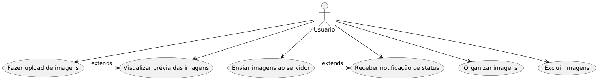
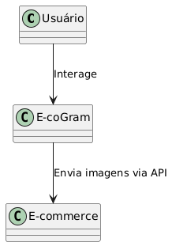

# Capa

- **Título do Projeto**: E-coGram.
- **Nome do Estudante**: Michael Aparecido Varaldo.
- **Curso**: Engenharia de Software.
- **Data de Entrega**: [xx/xx/xxxx].

# Resumo
O projeto consiste na criação de uma página de controle de imagens para qualquer site de e-commerce, com o objetivo de facilitar a seleção e o envio de imagens para publicação. Os principais pontos incluem uma interface intuitiva para escolha de imagens, gerenciamento eficiente de uploads, integração com o site e foco em usabilidade, atualização do processo de curaria visual.

## 1. Introdução
Contexto:
O projeto surge no âmbito de um e-commerce que necessita de uma solução eficiente para gerenciar o conteúdo visual de seus produtos. Com o aumento da demanda por atualizações rápidas e precisas no site, o manual de manipulação de imagens torna-se um processo demorado e suscetível a erros, impactando a experiência do usuário e a agilidade operacional.

Justificativa:
No campo da engenharia de software, a automação e otimização de processos repetitivos são essenciais para aumentar a produtividade e reduzir falhas. Este projeto é relevante pois propõe uma ferramenta que centraliza e simplifica o controle de imagens, alinhando-se às necessidades de escalabilidade e eficiência das plataformas de e-commerce. Além disso, contribui para a melhoria da qualidade do produto final selecionado ao cliente, um fator crítico nas negociações eletrônicas.

Objetivos:
O objetivo principal é desenvolver uma página de controle de imagens que permita a seleção e o envio organizado de imagens para o site de um e-commerce, aprimorando o fluxo de publicação. Os objetivos secundários incluem garantir uma interface intuitiva e amigável, integrar uma solução ao sistema existente do site e possibilitar uma gestão visual escalável e confiável.

## 2. Descrição do Projeto
Tema do Projeto:
O projeto tem como tema o desenvolvimento de uma página de controle de imagens externa para um site de e-commerce. A ferramenta a ser criada permitirá que os usuários selecionem, organizem e enviem imagens de produtos de forma eficiente, integrando-se ao sistema existente no site. A página será projetada para oferecer uma interface simples e funcional, com foco na otimização do processo de publicação de conteúdo visual.

Problemas a Solucionador:
Ineficiência no gerenciamento manual: Eliminar o tempo excessivo gasto na seleção e upload de imagens realizadas de forma manual.
Falta de organização: Resolver a desordem no fluxo de imagens, garantindo que apenas as selecionadas sejam enviadas ao site.
Erros humanos: Reduzir inconsistências ou falhas no processo de publicação, como envio de imagens erradas ou duplicadas.
Dificuldade de integração: Facilitar a conexão entre o controle de imagens e a plataforma de e-commerce já em uso.

Limitações:
O projeto não abordará o desenvolvimento de um sistema completo de edição de imagens (como configurações de tamanho ou filtros), focando apenas na seleção e envio. Também não incluirá a criação de uma infraestrutura de armazenamento de imagens, assumindo que o e-commerce já possui um servidor ou banco de dados para essa finalidade. Por fim, questões relacionadas à segurança avançada, como criptografia de dados, serão exclusivas do escopo inicial, sendo consideradas como possíveis melhorias futuras.

## 3. Especificação Técnica
Descrição detalhada da proposta, incluindo requisitos de software, protocolos, algoritmos, procedimentos, formatos de dados, etc.

## 3.1. Requisitos de Software
Apresentar os requisitos do tema proposto.

**Requisitos Funcionais (RF):**

- RF01: O sistema deve permitir que o usuário faça upload de imagens a partir de seu dispositivo local.
- RF02: O sistema deve exibir uma pré-visualização das imagens selecionadas antes do envio.
- RF03: O sistema deve permitir a organização das imagens por meio de arrastar e soltar.
- RF04: O sistema deve possibilitar a exclusão de imagens selecionadas antes do envio.
- RF05: O sistema deve integrar-se à API do e-commerce para envio das imagens ao servidor.
- RF06: O sistema deve notificar o usuário sobre o sucesso ou falha do upload de imagens.
- RF07: O sistema deve permitir a seleção de múltiplas imagens simultaneamente.
 
**Requisitos Não-Funcionais (RNF):**

- RNF01: A interface deve ser intuitiva e responsiva, com tempo de carregamento inferior a 2 segundos em conexões de 10 Mbps.
- RNF02: O sistema deve suportar até 100 imagens por sessão de upload sem degradação de desempenho.
- RNF03: A aplicação deve ser compatível com os navegadores Chrome, Firefox, Safari e Edge (versões mais recentes).
- RNF04: O sistema deve garantir que as imagens sejam exibidas com resolução adequada para pré-visualização (máximo de 1 MB por imagem).
- RNF05: A aplicação deve ser escalável para suportar até 100 usuários simultâneos.

Representação dos Requisitos:

## 3.2. Considerações de Design
Discussão sobre as escolhas de design, incluindo alternativas consideradas e justificativas para as decisões tomadas.
Visão Inicial da Arquitetura: Descrição dos componentes principais e suas interconexões.
Padrões de Arquitetura: Indicação de padrões específicos utilizados (ex.: MVC, Microserviços).

O design da aplicação prioriza simplicidade e eficiência, com uma interface de usuário minimalista para reduzir a curva de aprendizado. Foram consideradas duas abordagens principais:

Aplicação Monolítica: Uma única aplicação web com todas as funcionalidades integradas. Vantagem: simplicidade de desenvolvimento e manutenção. Desvantagem: menor escalabilidade.

Arquitetura Baseada em Componentes: Uso de uma arquitetura modular com React para componentes reutilizáveis. Vantagem: maior flexibilidade e escalabilidade. Desvantagem: maior complexidade inicial.

A abordagem baseada em componentes foi escolhida devido à necessidade de escalabilidade e à possibilidade de reutilizar componentes em futuras expansões do sistema.

Visão Inicial da Arquitetura

A arquitetura da aplicação é composta por três camadas principais:

- Frontend: Interface web para interação do usuário, construída com React.
- Backend: API RESTful para comunicação com o servidor do e-commerce, implementada com Node.js e Express.
- Serviço Externo: Integração com o servidor de armazenamento de imagens do e-commerce (assumido como existente).

Padrões de Arquitetura

O padrão MVC (Model-View-Controller) será utilizado no frontend:

- Model: Gerencia os dados das imagens (seleção, organização, status).
- View: Interface gráfica com componentes React.
- Controller: Lógica de interação, como manipulação de eventos de upload e arrastar/soltar.

No backend, será adotada uma abordagem de Microserviços para a API, permitindo futura expansão para outras funcionalidades, como validação de imagens.

**Modelos C4**

Nível 1: Contexto

Nível 2: Contêineres

- Aplicação Web: Interface React para upload e gerenciamento de imagens.
- API Gateway: Backend Node.js/Express para comunicação com o e-commerce.
- Serviço de Armazenamento: Servidor do e-commerce (externo) para armazenamento de imagens.

Nível 3: Componentes

- Componente de Upload: Gerencia a seleção e envio de arquivos.
- Componente de Visualização: Exibe pré-visualizações e permite organização.
- Componente de Notificação: Exibe mensagens de sucesso ou erro.
- API Client: Integra com a API do e-commerce.

Nível 4: CódigoOs componentes React serão estruturados em arquivos JSX, com hooks para gerenciamento de estado (useState, useEffect). O backend usará rotas Express para endpoints como /upload e /status.

## 3.3. Stack Tecnológica
Linguagens de Programação: Justificativa para a escolha de linguagens específicas.
Frameworks e Bibliotecas: Frameworks e bibliotecas a serem utilizados.
Ferramentas de Desenvolvimento e Gestão de Projeto: Ferramentas para desenvolvimento e gestão do projeto. ... qualquer outra informação referente a stack tecnológica ...

Linguagens de Programação

- JavaScript (ES6+): Escolhido para o frontend e backend devido à sua ampla adoção, suporte a frameworks modernos e integração com APIs REST.
- HTML5/CSS3: Para estruturação e estilização da interface.

Frameworks e Bibliotecas

- React (18.x): Para construção de componentes reutilizáveis e gerenciamento dinâmico da interface.
- Node.js (20.x) com Express: Para criação da API RESTful, devido à sua leveza e compatibilidade com JavaScript.
- Tailwind CSS: Para estilização rápida e responsiva da interface.
- Axios: Para chamadas HTTP à API do e-commerce.
- React-DnD: Para funcionalidade de arrastar e soltar.

Ferramentas de Desenvolvimento e Gestão de Projeto

- VS Code: Editor de código com suporte a extensões para JavaScript e React.
- Git/GitHub: Controle de versão e colaboração.
- Vite: Ferramenta de build para o frontend, por sua rapidez e suporte a React.
- Postman: Teste de APIs durante o desenvolvimento.

Outras Tecnologias

- ESLint/Prettier: Para padronização e formatação de código.
- Vitest: Para testes unitários no frontend.

## 3.4. Considerações de Segurança

Análise de Riscos

- Upload de Arquivos Maliciosos: Arquivos não-imagem ou com scripts maliciosos podem ser enviados.
- Ataques de Negação de Serviço (DoS): Uploads massivos podem sobrecarregar o servidor.
- Acesso Não Autorizado: Usuários não autenticados podem tentar acessar a API.

Mitigações

- Validação de Arquivos: Restringir uploads a formatos de imagem (JPEG, PNG, WEBP) e limitar o tamanho máximo a 5 MB por arquivo.
- Limitação de Taxa (Rate Limiting): Implementar limitação de requisições na API para evitar sobrecarga.
- Autenticação: Embora fora do escopo inicial, recomendar a integração com um sistema de autenticação (como OAuth ou JWT) para futuras iterações.
- Sanitização de Entradas: Verificar e sanitizar todos os dados enviados pelo frontend para evitar injeção de código.

## 4. Próximos Passos
Descrição dos passos seguintes após a conclusão do documento, com uma visão geral do cronograma para Portfólio I e II.

## 5. Referências
Listagem de todas as fontes de pesquisa, frameworks, bibliotecas e ferramentas que serão utilizadas.

## 6. Apêndices (Opcionais)
Informações complementares, dados de suporte ou discussões detalhadas fora do corpo principal.

## 7. Avaliações de Professores
Adicionar três páginas no final do RFC para que os Professores escolhidos possam fazer suas considerações e assinatura:

Considerações Professor/a:
Considerações Professor/a:
Considerações Professor/a:

